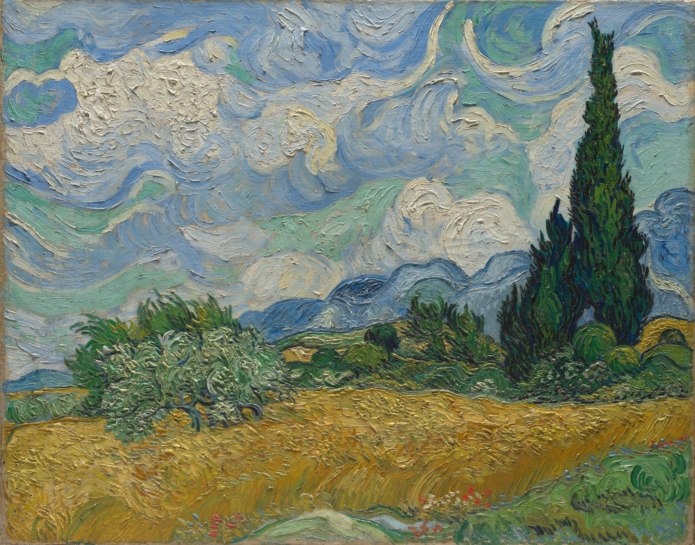
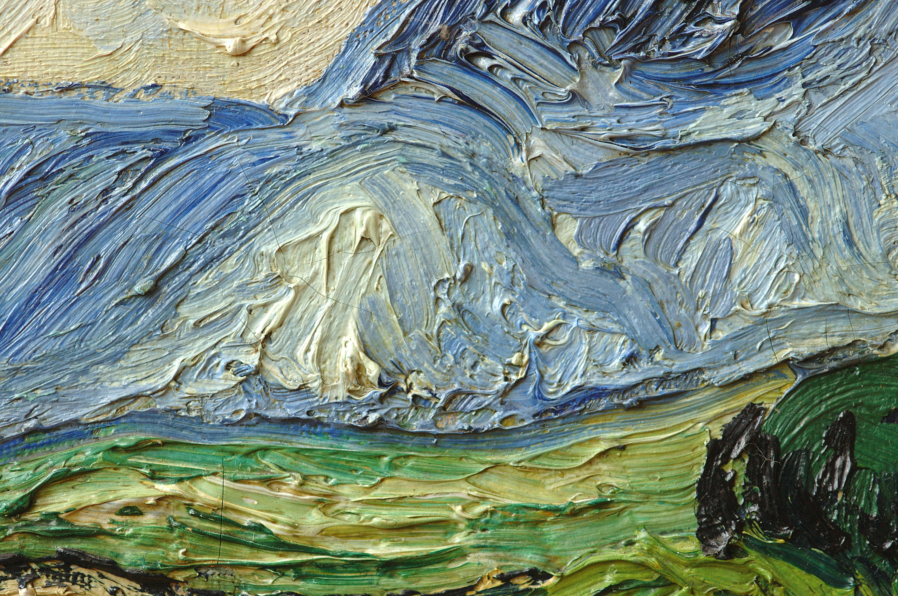
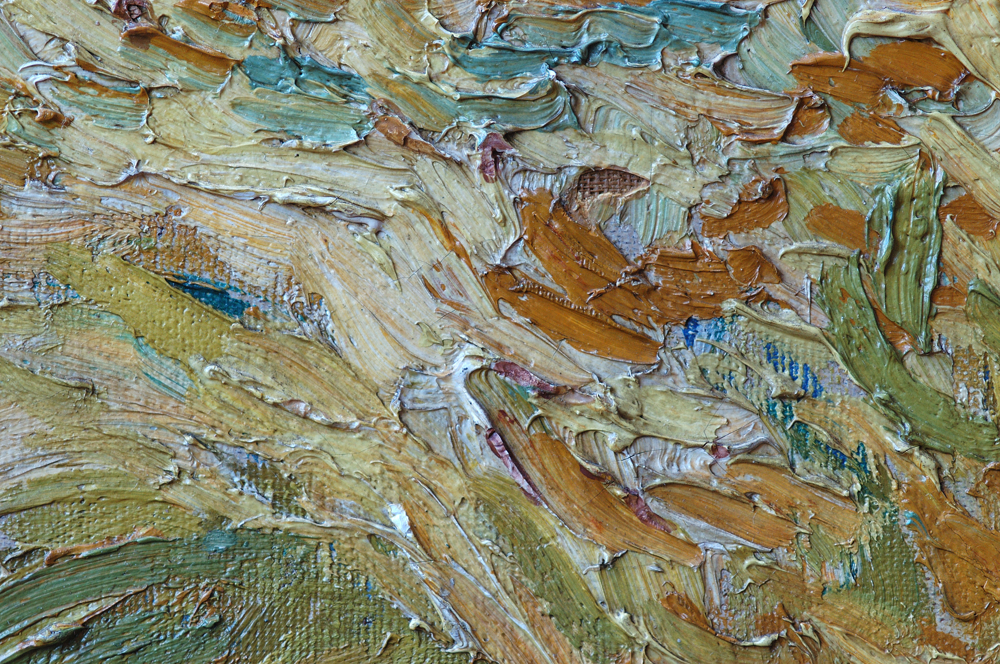
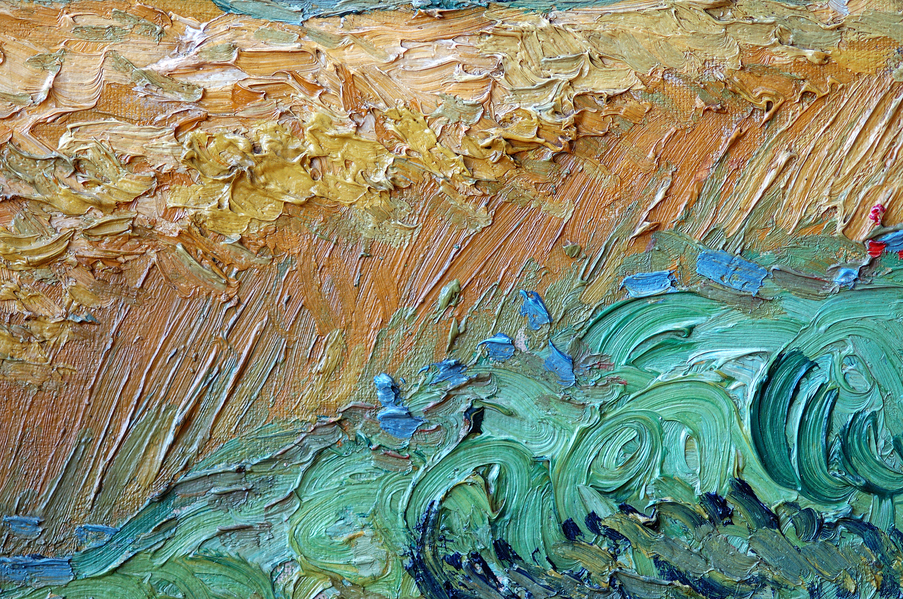

# Omarchy Wheat Field with Cypresses Theme

A light Omarchy theme built around a single painting: Vincent van Gogh's Wheat Field with Cypresses.

    [](https://github.com/mattbbia?tab=repositories)  

 


## Inspiration

Vincent van Gogh painted Wheat Field with Cypresses in June 1889 while a patient at the asylum in Saint-Rémy-de-Provence, part of the same burst of work that produced The Starry Night. Wind-driven wheat, a flame-like cypress, and rolling hills are built up in the thick, swirling impasto that defines his late style.

Rather than just using the full painting as a backdrop, this theme is built around getting close to it — pulling out sections of canvas where the brushwork itself becomes the subject: the weave of the paint, a single stroke of blue cutting through the impasto, the texture changing from one side of the foreground to the other. Zoomed in, it stops reading as a wheat field and starts reading as paint.

## Wallpaper Gallery

This theme includes the full painting plus three close-up details of its brushwork and texture:

| Preview | Artwork |
| ------- | ------- |
|  | Wheat Field with Cypresses (1889) |
|  | Center of Canvas — Blue Stroke Through Impasto |
|  | Left Foreground — Weave Imprint in Impasto |
|  | Right Foreground — Varied Brushwork |

## Color Palette

### Backgrounds


### Golden Wheat


### Cypress & Sky


## Components

- Aether
- Alacritty
- btop
- Chromium
- Foot
- Ghostty
- Hyprland
- Kitty
- Neovim
- Omarchy Shell (bar, lock screen, notifications, launcher, on-screen display)
- Vencord
- VS Code
- Warp
- Zellij

## Installation

Clone or install the project:
```bash
omarchy-theme-install https://github.com/mattbbia/wheat-field-with-cypresses.git
```
### OR

1. Open the Omarchy menu (**Super + Alt + Space**).
2. Go to **Install > Style > Theme**.
3. Paste this repo URL: `https://github.com/mattbbia/wheat-field-with-cypresses.git`
4. Hit Enter.

## Contributing

Contributions, bug reports, feature requests, and suggestions are always welcome. Feel free to open an issue or submit a pull request.

## Support

If you enjoy this theme and would like to support future themes, you can:

- ⭐ Star this repository
- 💡 Suggesting new themes
- ☕ Supporting future themes

[](https://buymeacoffee.com/mattbbia)

## Acknowledgements

Artwork by **Vincent van Gogh (1853–1890)**. Wheat Field with Cypresses is in the public domain; several painted versions exist across different collections, and the high-resolution source images used in this theme were obtained for appreciation and preservation of public-domain art.

## License

This project is licensed under the MIT License. See the LICENSE file for details.
